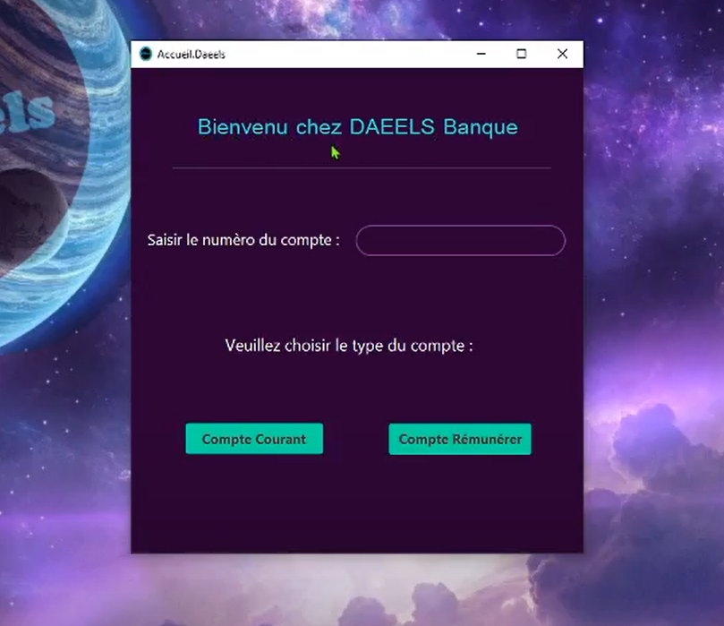
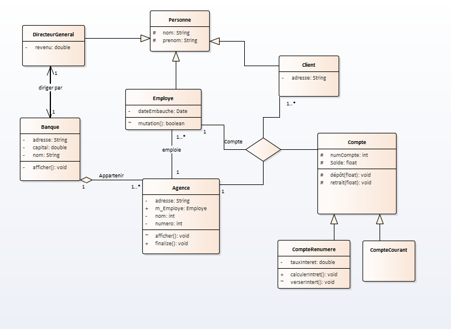
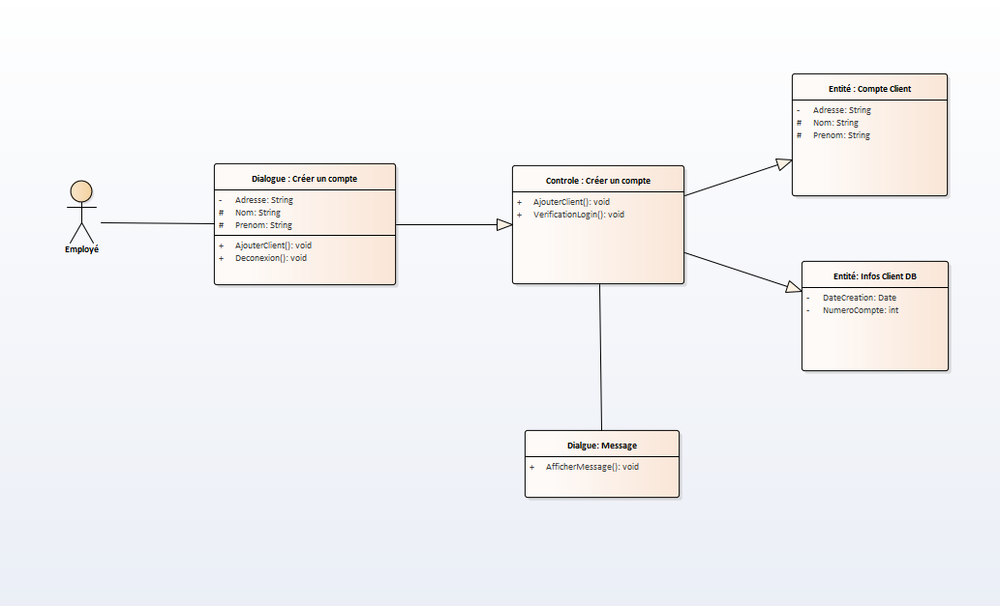
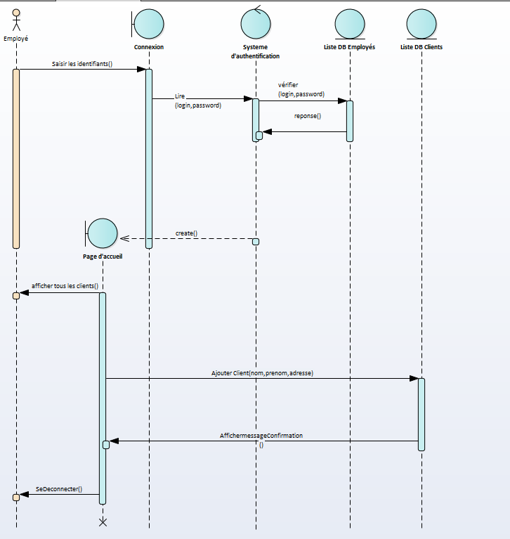
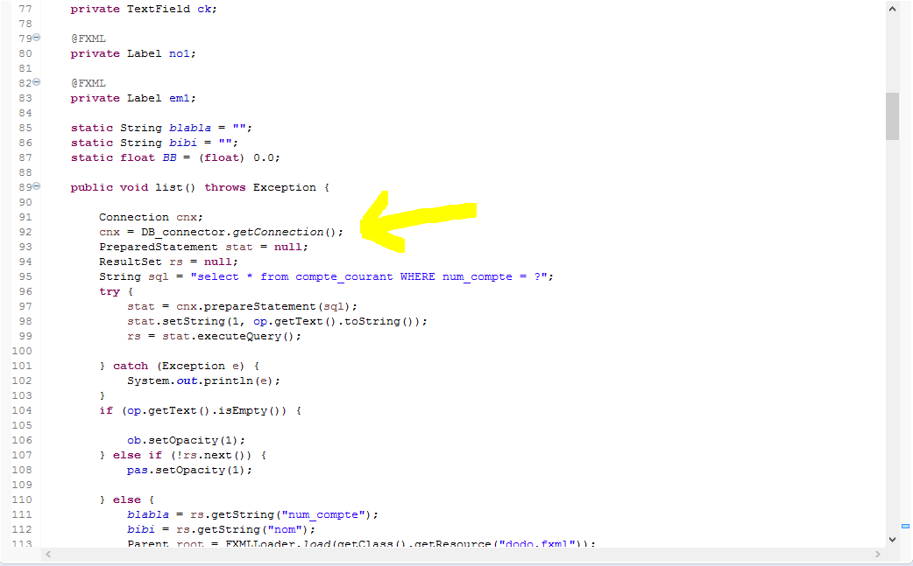

# Java Mini Bank

* In the context of a Java mini project at the university.
* It's about creating a java bank app with database connection and a GUI using javaFx.

* Descriptive video of all GUI featuresn exception testing ....
[Video link](https://drive.google.com/file/d/1i0koLdLDM8kq4GCY6W2hYjOWxcEqN1cP/view?usp=sharing)

Description : 

I- Class Diagram:

II- Participating Class Diagram:

III- Design Sequence Diagram (White Box):

IV- Use of a Database to Store Data:

